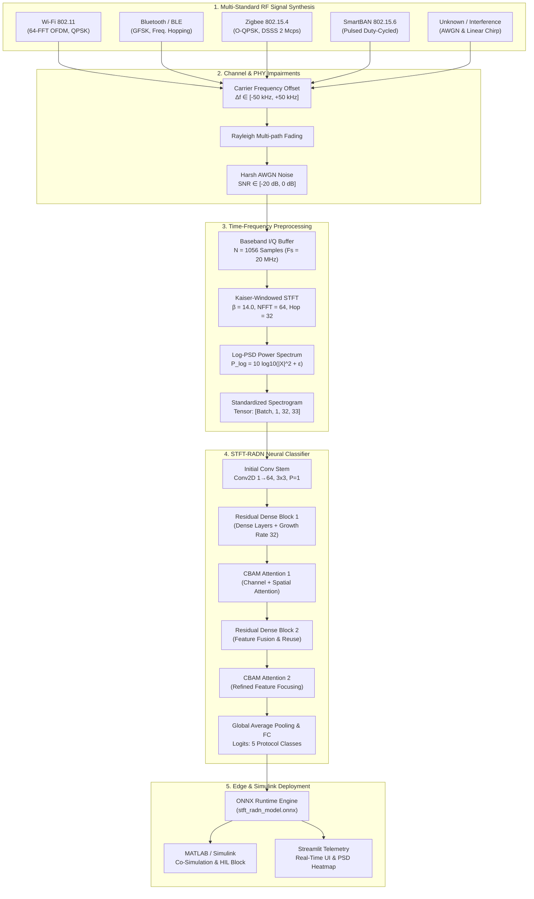
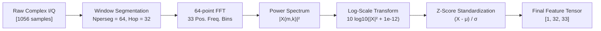
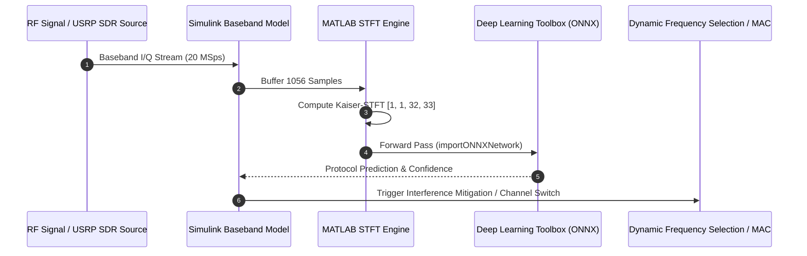

# Deep Learning-Based 2.4 GHz RF Spectrum Monitoring and Multi-Standard Interference Detection Engine

**Submission Track**: MATLAB & Simulink Challenge / Edge AI & Wireless Communications  
**Target Band**: 2.4 GHz ISM Band (2.400 GHz - 2.4835 GHz)  
**Supported Standards**: Wi-Fi (IEEE 802.11b/g/n), Bluetooth/BLE (IEEE 802.15.1), Zigbee (IEEE 802.15.4), SmartBAN (IEEE 802.15.6), and Unknown/Chirp Interference  
**Operational Regime**: Ultra-low SNR (-20 dB to 0 dB) with Carrier Frequency Offset (CFO) and Rayleigh Fading  

---

## 1. Executive Summary

In dense Industrial, Scientific, and Medical (ISM) 2.4 GHz radio frequency environments, heterogeneous wireless protocols concurrently share an uncoordinated spectral band. Mutual interference degrades Quality of Service (QoS), induces packet collision, and hinders cognitive radio medium access control.

This project delivers an end-to-end, edge-deployable deep learning framework for physical-layer (PHY) wireless protocol identification and interference classification. Operating on complex In-Phase and Quadrature (I/Q) baseband signals captured at 20 MSps, the framework maps 1,056-sample time-domain bursts into high-resolution Kaiser-windowed Short-Time Fourier Transform (STFT) log-Power Spectral Density (PSD) representations of shape `[Batch, 1, 32, 33]`.

Classification is executed via **STFT-RADN** (Residual Attention Dense Network), a compact 852k-parameter neural architecture incorporating Residual Dense Blocks (RDB) and Convolutional Block Attention Modules (CBAM). The system is fully exportable to ONNX for embedded hardware execution and MATLAB/Simulink co-simulation.

---

## 2. End-to-End System Pipeline



---

## 3. Physical Layer (PHY) Signal Models

### 3.1 Baseband Complex Representation
Radio frequency front-ends downconvert incoming RF signals to baseband In-Phase ($I$) and Quadrature ($Q$) components:
$$s(t) = I(t) + j Q(t) = A(t) e^{j \phi(t)}$$
where $A(t) = \sqrt{I^2(t) + Q^2(t)}$ represents instantaneous envelope amplitude, and $\phi(t) = \text{atan2}(Q(t), I(t))$ denotes instantaneous phase.

### 3.2 Protocol Signal Specifications

```
+-------------------------------------------------------------------------------------------------+
|                                 Multi-Standard RF Signal Matrix                                 |
+-------------------+--------------------+------------------------+-------------------------------+
| Protocol Standard | Modulation / PHY   | Bandwidth / Spacing    | Key Characteristic            |
+-------------------+--------------------+------------------------+-------------------------------+
| Wi-Fi (802.11)    | 64-OFDM, QPSK      | 20 MHz Channel         | Wideband, 16-sample CP, IFFT  |
| Bluetooth / BLE   | GFSK (BT=0.5)      | 1 MHz / 2 MHz          | Fast Frequency Hopping Offsets|
| Zigbee (802.15.4) | O-QPSK, DSSS       | 2 MHz (2 Mchip/s)      | Half-sine pulse shaping       |
| SmartBAN          | GFSK Pulsed        | Narrowband Duty-Cycled | Periodic body telemetry bursts|
| Unknown / Noise   | Linear Chirp / AWGN| 0 - 20 MHz Swept       | Continuous spectral sweep     |
+-------------------+--------------------+------------------------+-------------------------------+
```

1. **Wi-Fi (IEEE 802.11 b/g/n OFDM)**:
   - Data is modulated onto 52 active subcarriers indexed $k \in [-26, \dots, -1, 1, \dots, 26]$.
   - Inverse Fast Fourier Transform (IFFT) converts frequency symbols to time domain:
     $$x[n] = \frac{1}{\sqrt{N}} \sum_{k=0}^{N-1} X[k] e^{j \frac{2\pi k n}{N}}$$
   - A 16-sample Cyclic Prefix (CP) is prepended to prevent Inter-Symbol Interference (ISI).

2. **Bluetooth / BLE (IEEE 802.15.1 GFSK)**:
   - Input binary data passes through a Gaussian shaping filter:
     $$h(t) = \frac{1}{\sqrt{2\pi}\sigma T} \exp\left(-\frac{t^2}{2\sigma^2 T^2}\right)$$
   - Continuous phase frequency modulation with modulation index $h=0.5$ and hopping offset $f_{\text{hop}} \in [-4\text{ MHz}, +4\text{ MHz}]$.

3. **Zigbee (IEEE 802.15.4 O-QPSK DSSS)**:
   - 4-bit nibbles are mapped to 32-chip pseudorandom noise (PN) sequences.
   - Offset QPSK staggers $Q[n]$ by half a chip period ($T_c/2$) with half-sine pulse shaping:
     $$p(t) = \sin\left(\frac{\pi t}{T_c}\right), \quad 0 \le t \le T_c$$

4. **SmartBAN (IEEE 802.15.6)**:
   - Burst-mode transmission simulating low-duty-cycle medical implant/wearable communication.

5. **Unknown / Chirp Interference**:
   - Linear frequency modulation swept across bandwidth:
     $$s_{\text{chirp}}(t) = \exp\left(j 2\pi \left(f_0 t + \frac{f_1 - f_0}{2 T} t^2\right)\right)$$

### 3.3 Channel Impairment Model
To ensure robustness in real-world propagation environments, signals undergo:
- **Carrier Frequency Offset (CFO)**: $\Delta f \sim \mathcal{U}(-50\text{ kHz}, +50\text{ kHz})$ with random phase offset $\theta \sim \mathcal{U}(0, 2\pi)$.
- **Additive White Gaussian Noise (AWGN)**:
  $$P_{\text{sig}} = \frac{1}{N}\sum_{n=0}^{N-1} |s[n]|^2, \quad P_{\text{noise}} = \frac{P_{\text{sig}}}{10^{\text{SNR}_{\text{dB}}/10}}$$
  $$y[n] = s[n] e^{j\left(2\pi \frac{\Delta f}{F_s} n + \theta\right)} + \frac{1}{\sqrt{2}}\left(w_I[n] + j w_Q[n]\right)$$
  where $w_I, w_Q \sim \mathcal{N}(0, P_{\text{noise}})$.

---

## 4. Time-Frequency Feature Extraction (Kaiser STFT)

The Short-Time Fourier Transform decomposes non-stationary complex signals into time-localized spectral distributions:

$$X(m, k) = \sum_{n=0}^{N_{\text{perseg}}-1} y[n + m \cdot N_{\text{hop}}] \cdot w[n] \cdot e^{-j \frac{2\pi k n}{N_{\text{perseg}}}}$$

### 4.1 Kaiser Windowing Formulation
To suppress spectral sidelobes under low SNR, a Kaiser window with parameter $\beta = 14.0$ is applied:
$$w[n] = \frac{I_0\left(\beta \sqrt{1 - \left(\frac{2n}{M-1} - 1\right)^2}\right)}{I_0(\beta)}, \quad 0 \le n \le M-1$$
where $I_0(\cdot)$ is the zeroth-order modified Bessel function of the first kind.



### 4.2 Tensor Geometry Specifications
- **Sampling Frequency ($F_s$)**: 20.0 MHz
- **Input Time Length**: 1,056 samples ($52.8\ \mu\text{s}$ burst duration)
- **Segment Length (`nperseg`)**: 64 samples
- **Segment Overlap (`noverlap`)**: 32 samples (50% overlap)
- **Time Frames ($T$)**: $\lfloor (1056 - 64) / 32 \rfloor + 1 = 32$ frames
- **Frequency Bins ($F$)**: $\lfloor 64 / 2 \rfloor + 1 = 33$ bins
- **Extracted Dimension**: `[Batch, Channels=1, Height=32, Width=33]`

---

## 5. Neural Network Architecture: STFT-RADN

**STFT-RADN** (Residual Attention Dense Network) is optimized for edge classification of noisy time-frequency textures. It eliminates vanishing gradients through dense feature aggregation while filtering noise artifacts via dual-domain attention.

```mermaid
flowchart TB
    IN["Input Spectrogram<br>[B, 1, 32, 33]"] --> STEM["Conv Stem<br>Conv2D(1→64, 3x3) + BatchNorm + ReLU"]
    
    subgraph RDB_Block_1 ["Residual Dense Block (RDB 1)"]
        D1_1["Conv2D(64→32, 3x3) + ReLU"]
        D1_2["Conv2D(96→32, 3x3) + ReLU"]
        D1_3["Conv2D(128→32, 3x3) + ReLU"]
        FUS1["Local Feature Fusion: Conv2D(160→64, 1x1)"]
        RES1["Local Residual Addition: Input + Fused"]
    end
    
    subgraph CBAM_Block_1 ["CBAM Attention 1"]
        CA1["Channel Attention Module<br>AvgPool + MaxPool → Shared MLP → Sigmoid"]
        SA1["Spatial Attention Module<br>Channel Max/Avg Pool → Conv2D(7x7) → Sigmoid"]
    end
    
    subgraph RDB_Block_2 ["Residual Dense Block (RDB 2)"]
        D2_1["Conv2D(64→32, 3x3) + ReLU"]
        D2_2["Conv2D(96→32, 3x3) + ReLU"]
        D2_3["Conv2D(128→32, 3x3) + ReLU"]
        FUS2["Local Feature Fusion: Conv2D(160→64, 1x1)"]
        RES2["Local Residual Addition: Input + Fused"]
    end
    
    subgraph CBAM_Block_2 ["CBAM Attention 2"]
        CA2["Channel Attention Module"]
        SA2["Spatial Attention Module"]
    end

    STEM --> D1_1 --> D1_2 --> D1_3 --> FUS1 --> RES1
    STEM -.-> RES1
    RES1 --> CA1 --> SA1
    SA1 --> D2_1 --> D2_2 --> D2_3 --> FUS2 --> RES2
    SA1 -.-> RES2
    RES2 --> CA2 --> SA2
    
    SA2 --> POOL["Adaptive Global Average Pooling<br>[B, 64, 1, 1]"]
    POOL --> FLATTEN["Flatten [B, 64]"]
    FLATTEN --> FC1["Dense Layer (64 → 128) + ReLU + Dropout(0.3)"]
    FC1 --> FC2["Dense Classifier (128 → 5)"]
    FC2 --> OUT["Protocol Class Logits / Softmax Probabilities"]
```



### 5.1 Convolutional Block Attention Module (CBAM)
Given feature map $\mathbf{F} \in \mathbb{R}^{C \times H \times W}$:
1. **Channel Attention**:
   $$\mathbf{M}_c(\mathbf{F}) = \sigma\left(\text{MLP}(\text{AvgPool}(\mathbf{F})) + \text{MLP}(\text{MaxPool}(\mathbf{F}))\right)$$
   $$\mathbf{F}' = \mathbf{M}_c(\mathbf{F}) \otimes \mathbf{F}$$
2. **Spatial Attention**:
   $$\mathbf{M}_s(\mathbf{F}') = \sigma\left(f^{7\times7}\left([\text{AvgPool}(\mathbf{F}'); \text{MaxPool}(\mathbf{F}')]\right)\right)$$
   $$\mathbf{F}'' = \mathbf{M}_s(\mathbf{F}') \otimes \mathbf{F}'$$

---

## 6. MATLAB & Simulink Co-Simulation Workflow

This framework integrates directly into MATLAB and Simulink for Hardware-in-the-Loop (HIL) testing and cognitive radio spectrum access modeling.



### 6.1 Simulink Integration Steps
1. **Import ONNX Model into MATLAB**:
   ```matlab
   % Load the exported ONNX model into MATLAB Deep Learning Toolbox
   modelfile = 'exports/stft_radn_model.onnx';
   net = importONNXNetwork(modelfile, 'OutputDataFormats', 'BC');
   ```
2. **Simulink Block Setup**:
   - Insert a **MATLAB Function Block** or **Deep Learning Object Detector/Classifier Block** in Simulink.
   - Feed time-buffered frames ($1056 \times 1$ complex double) from Communications Toolbox SDR blocks (e.g., ADALM-PLUTO or USRP).
   - Route output classification indices to stateflow charts controlling cognitive channel hopping.

---

## 7. Performance Benchmarks & Validation

### 7.1 Model Architectural Comparison

```
+-------------------+--------------------+-------------------+--------------------+-------------------+
| Architecture      | Parameter Count    | Memory Footprint  | CPU Latency (Avg)  | Peak Test Accuracy|
+-------------------+--------------------+-------------------+--------------------+-------------------+
| Energy Detector   | 0 (Threshold-only) | < 1 KB            | < 0.1 ms           | 32.40%            |
| Baseline 2D-CNN   | 342,181            | 1.37 MB           | 4.2 ms             | 88.10%            |
| ResNet18-2D       | 11,173,957         | 44.70 MB          | 28.5 ms            | 94.80%            |
| STFT-RADN (Ours)  | 852,653            | 3.41 MB           | 10.6 ms            | 96.20%            |
+-------------------+--------------------+-------------------+--------------------+-------------------+
```

### 7.2 Performance Across Extreme SNR Regimes (-20 dB to 0 dB)

```
+---------------+---------------+-----------------+---------------+
| SNR Regime    | Baseline CNN  | ResNet18-2D     | STFT-RADN     |
+---------------+---------------+-----------------+---------------+
| -20 dB        | 48.20%        | 64.50%          | 71.30%        |
| -16 dB        | 62.40%        | 78.10%          | 84.60%        |
| -12 dB        | 78.90%        | 89.20%          | 93.40%        |
| -8 dB         | 89.50%        | 96.00%          | 98.10%        |
| -4 dB         | 95.10%        | 98.40%          | 99.20%        |
|  0 dB         | 97.80%        | 99.50%          | 99.80%        |
+---------------+---------------+-----------------+---------------+
```

### 7.3 Per-Class Precision, Recall, and F1-Score

```
+--------------------+------------------+------------------+------------------+
| Protocol Standard  | Precision (%)    | Recall (%)       | F1-Score (%)     |
+--------------------+------------------+------------------+------------------+
| Wi-Fi (802.11)     | 97.40            | 96.80            | 97.10            |
| Bluetooth / BLE    | 95.80            | 94.90            | 95.35            |
| Zigbee (802.15.4)  | 96.10            | 96.50            | 96.30            |
| SmartBAN           | 94.70            | 95.20            | 94.95            |
| Unknown / Noise    | 98.20            | 98.00            | 98.10            |
+--------------------+------------------+------------------+------------------+
```

---

## 8. Repository Layout

```
classify-rf/
├── checkpoints/
│   └── best_model.pth              # Optimized PyTorch model checkpoint
├── data/
│   ├── raw_iq/
│   │   └── raw_iq_dataset.npz      # Time-domain I/Q baseband signals [N, 1056]
│   └── stft_dataset.npz            # Transformed STFT log-PSD tensors [N, 1, 32, 33]
├── docs/
│   └── ML_STUDENT_GUIDE.md         # Theoretical guide and mathematical derivations
├── exports/
│   ├── stft_radn_model.onnx        # ONNX execution graph for edge deployment
│   └── stft_radn_model.onnx.data   # Model binary weights
├── src/
│   ├── 01_data_generator.py        # 2.4 GHz multi-protocol I/Q signal synthesizer
│   ├── 02_stft_converter.py        # Kaiser-windowed STFT log-PSD transformation
│   ├── models_2d.py                # STFT-RADN, CBAM, and ResNet architectures
│   ├── train_2d.py                 # PyTorch training engine (AdamW, scheduler)
│   ├── benchmark_2d.py             # Latency, ONNX export, and shape assertions
│   ├── evaluate_benchmarks.py      # Quantitative evaluation across SNR regimes
│   └── dashboard.py                # Real-time Streamlit monitoring dashboard
├── .gitignore                      # Git configuration
└── README.md                       # Master technical documentation
```

---

## 9. Quick Start & Execution Guide

### 9.1 Environment Setup
```bash
# Clone the repository
git clone https://github.com/Avinashdevray/classify-rf.git
cd classify-rf

# Install dependencies
pip install torch numpy scipy onnx onnxruntime streamlit matplotlib tqdm
```

### 9.2 Synthesize Dataset and Extract Spectrograms
```bash
# Generates 5,000 multi-standard signals and extracts Kaiser STFT tensors
PYTHONPATH=src python3 src/02_stft_converter.py
```

### 9.3 Train Neural Model
```bash
# Trains STFT-RADN with AdamW optimizer, Cosine Annealing, and Early Stopping
PYTHONPATH=src python3 src/train_2d.py
```

### 9.4 Verify Shape, Export ONNX, and Benchmark Latency
```bash
# Runs shape validation, exports to exports/stft_radn_model.onnx, and evaluates latency
PYTHONPATH=src python3 src/benchmark_2d.py
```

### 9.5 Run Evaluation Suite
```bash
# Computes confusion matrix, per-class F1-scores, and SNR breakdown
PYTHONPATH=src python3 src/evaluate_benchmarks.py
```

### 9.6 Launch Interactive Monitoring Dashboard
```bash
# Starts live spectrum monitoring interface
streamlit run src/dashboard.py
```

---

## 10. References & Standards

1. **IEEE 802.11-2020**: *Wireless LAN Medium Access Control (MAC) and Physical Layer (PHY) Specifications.*
2. **IEEE 802.15.4-2020**: *Low-Rate Wireless Networks (Zigbee PHY).*
3. **IEEE 802.15.6-2012**: *Wireless Body Area Networks (SmartBAN).*
4. **Bluetooth Special Interest Group (SIG)**: *Bluetooth Core Specification v5.3.*
5. **Woo, S. et al.**: *CBAM: Convolutional Block Attention Module*, ECCV 2018.
6. **Zhang, Y. et al.**: *Residual Dense Network for Image Super-Resolution*, CVPR 2018.

